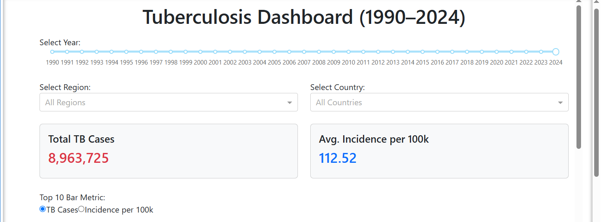
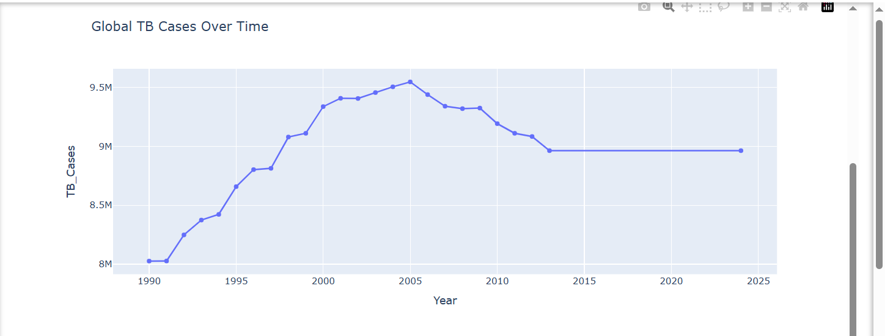
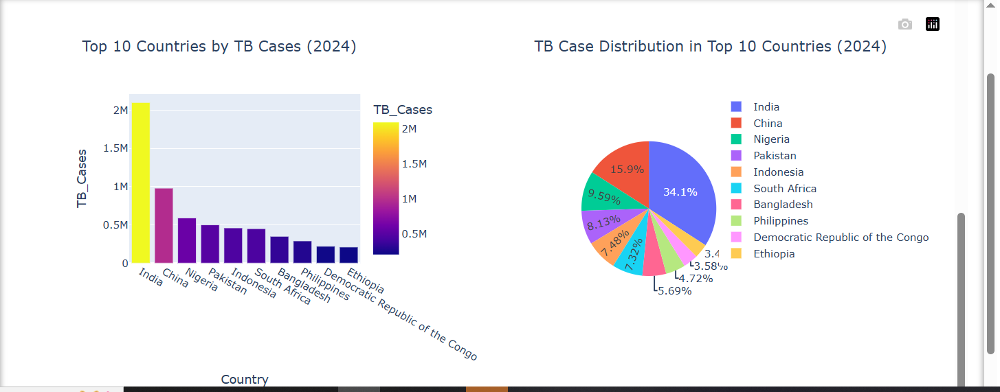

# 🧪 Tuberculosis (TB) Data Visualization Project

An interactive dashboard that visualizes Tuberculosis (TB) trends from **1990 to 2013** using WHO-provided data. Developed as part of a data visualization mini project to support public health research and policy planning.

---

## 📚 Project Overview

This project aims to help users—such as public health experts, researchers, and students—explore TB patterns, identify insights, and support data-driven decisions through visual exploration.

### 🎯 Objectives

- Present TB data in a clear, interactive format.
- Identify trends across years and countries.
- Offer insights and predictions for future health policy.

---

## 🗂️ Dataset & Cleaning

- **File**: `TB_Burden_Country.csv`  
- **Source**: World Health Organization (WHO)  
- **Coverage**: Global TB indicators (1990–2013)

### 🔧 Data Cleaning Process

- Loaded using **pandas**
- Removed irrelevant/incomplete records
- Handled missing values and standardized formats
- Mapped ISO3 to ISO2 codes
- Ensured proper data types for numerical analysis

---

## 📊 Dashboard Features

Built with **Dash**, **Plotly**, and **Dash Bootstrap Components**.

### Key Performance Indicators (KPIs)

- Total TB cases per year/country  
- Incidence rate per 100,000 people  

### Visualizations

- 📈 **Line Chart** – TB trends over time  
- 📊 **Bar Chart** – Country-wise comparison  
- 🥧 **Pie Chart** – Regional/country TB distribution  

### Filters & Controls

- **Year Selector (1990–2013)**  
- **Country/Region Selector**  
- Charts dynamically update based on filters

---

## 📖 Data Story

### Past (1990–2013)

- TB was a significant global health threat.
- Countries like China and Brazil saw improvement.
- Regions like sub-Saharan Africa faced rising TB cases due to limited healthcare access.

### Present (2013)

- TB incidence globally declined, but inequality remained.
- Some regions saw breakthroughs thanks to awareness and medical access.

### Future Insights

- Continued decline possible with targeted interventions.
- Recommended strategies:
  - Expand diagnostics
  - Focus on high-burden areas
  - Use predictive modeling
  - Increase funding

---

## 🚀 Optional Extension (2024)

Integration of updated **2024 WHO TB data** can:

- Measure actual progress vs. past predictions
- Improve future planning
- Add real-time insights

---

## ⚙️ Tech Stack

| Component          | Tool/Library                  |
|-------------------|-------------------------------|
| Programming        | Python                        |
| Data Handling      | Pandas, NumPy                 |
| Visualization      | Plotly, Plotly Express        |
| Dashboard Framework| Dash + Dash Bootstrap Components |
| Interactivity      | Dash Callbacks, Dropdowns, Filters |

---

## 📸 Dashboard Preview

> A screenshot of the final dashboard showing trends, KPIs, and controls can be inserted here.

---

## 🏁 Conclusion

This project illustrates the power of **data visualization** in translating complex health data into actionable insights. By combining cleaned TB data with interactive visual tools, we created a valuable resource for exploring trends, disparities, and policy strategies.

---

## 📄 License

This project is part of a university assignment and is intended for educational use.

---

## 🧠 Acknowledgements

- World Health Organization (WHO)
- Dash and Plotly teams
- Python open-source community
